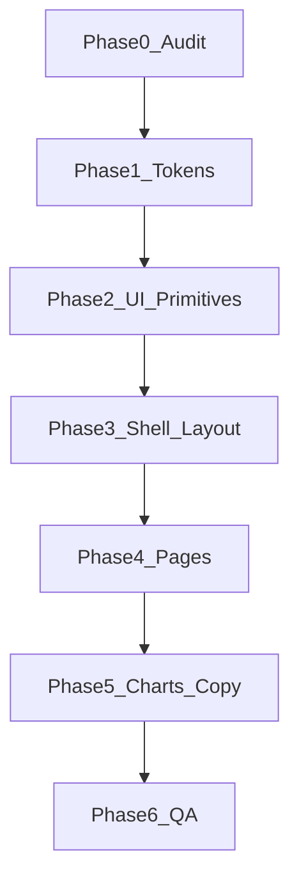

# نقشه راه فازبندی — Premium Enterprise UI

## وضعیت فعلی (خلاصه)

| پرامپت | وضعیت در پروژه |
|--------|----------------|
| CSS Variables + Dark/Light | موجود در [`src/styles/tokens.css`](src/styles/tokens.css) + `data-theme` در [`src/app/layout.jsx`](src/app/layout.jsx) |
| Inter + antialiased | موجود |
| SVG به‌جای emoji | [`NavIcon.jsx`](src/components/layout/NavIcon.jsx) و آیکون‌های inline |
| radius 6–12px | `--radius-sm/md/card` مناسب |
| focus-visible | global + کامپوننت‌ها |
| **یک accent** | چند رنگ تزئینی: `--color-chart-violet/warm` + گرادیان hero/CTA |
| **border به‌جای shadow** | `Card`/`StatCard`/`Header` هنوز `shadow-[var(--shadow-card)]` |
| **micro-motion استاندارد** | پراکنده `ease-out`؛ بدون token واحد `cubic-bezier(0.4,0,0.2,1)` |
| **فضای سفید بیشتر** | `--space-card-padding: 1.25rem` و `max-w-6xl` — قابل افزایش |

**نتیجه:** پرامپت را به‌صورت «خروجی HTML کامل» روی این repo اعمال نکنید. همان اصول را روی **توکن → primitive → shell → صفحات** پیاده کنید.

---

## فاز ۰ — ممیزی و معیار پذیرش (نیم‌روز)

**هدف:** لیست ثابت «چه چیزی تغییر می‌کند» قبل از کدنویسی.

- اسکرین‌شات dark/light از: `/`, `/market`, `/coin/[id]`, `/portfolio`.
- علامت‌گذاری موارد «toy-like» در کد:
  - گرادیان عنوان: `.market-hero-title-gradient` در [`globals.css`](src/app/globals.css) (~357)
  - CTA گرادیان + `#7c9cff` hardcode (~515)
  - سایه روی کارت/هدر (نه dropdown)
- تعریف **یک accent نهایی** (مثلاً نگه‌داشتن `--color-accent` فعلی یا مهاجرت به Zinc/Slate + accent ملایم‌تر).
- **Definition of Done:** هیچ گرادیان روی دکمه/تیتر؛ کارت‌ها فقط border؛ فقط `--shadow-float` برای منو/مودال/sticky overlay.

---

## فاز ۱ — سیستم طراحی (توکن‌ها) — ۱ روز

**فایل محور:** [`src/styles/tokens.css`](src/styles/tokens.css)، [`src/app/globals.css`](src/app/globals.css)

1. **پالت neutral:** بازنگری `--color-bg/surface/text-*` روی مقیاس Zinc/Slate (کم‌اشباع، یکدست dark/light).
2. **یک accent برای action:** `--color-accent` + `--color-accent-muted`؛ `--color-chart-violet/warm` فقط داخل chart (نه chrome/UI).
3. **Border-first:** `--color-border: rgba(128,128,128,0.15)` (یا معادل token فعلی)؛ `--shadow-card: none` یا حذف استفاده از آن.
4. **Typography tokens:** `--line-height-body: 1.6`؛ headingها `font-weight: 600–700` + `letter-spacing: -0.02em`؛ body `font-weight: 400–450`.
5. **Motion tokens:** `--ease-standard: cubic-bezier(0.4, 0, 0.2, 1)`؛ `--duration-fast: 150ms`.
6. **Spacing:** افزایش `--space-card-padding` (مثلاً 1.5–1.75rem)، `--space-section-gap` (2rem+)، و در layout padding عمودی بیشتر.

همگام‌سازی Tailwind: mapping موجود در `@theme inline` در [`globals.css`](src/app/globals.css) را با توکن‌های جدید به‌روز کنید.

---

## فاز ۲ — UI Primitives (کیت کامپوننت) — ۱–۲ روز

**فایل‌ها:** [`src/components/ui/*`](src/components/ui/)

| کامponent | تغییر کلیدی |
|-----------|-------------|
| [`Card.jsx`](src/components/ui/Card.jsx) | حذف `shadow-card` از default/elevated؛ border + `bg-surface`؛ hover فقط `surface-hover` |
| [`Button.jsx`](src/components/ui/Button.jsx) | primary solid accent (بدون brightness hack اگر لازم شد `translateY(-1px)` + opacity)؛ transition با `--ease-standard` |
| [`Input.jsx`](src/components/ui/Input.jsx) / [`Select.jsx`](src/components/ui/Select.jsx) | ring روی `:focus-visible` یکدست با global |
| [`Tabs.jsx`](src/components/ui/Tabs.jsx) | pill فعال: accent solid؛ غیرفعال: بدون پس‌زمینه سنگین |
| [`Badge.jsx`](src/components/ui/Badge.jsx) | up/down/neutral فقط برای داده بازار (نه decor) |
| [`Table.jsx`](src/components/ui/Table.jsx) | header uppercase ملایم؛ row hover subtle |
| [`Skeleton.jsx`](src/components/ui/Skeleton.jsx) / Empty / Error | border dashed/subtle؛ بدون پس‌زمینه قرمز پررنگ در Error (muted down) |

**تست:** [`src/components/ui/ui.test.tsx`](src/components/ui/ui.test.tsx) — رفتار a11y/loading نباید بشکند؛ فقط در صورت تغییر className قراردادی، snapshot/class assertion را به‌روز کنید.

**اختیاری:** نصب `lucide-react` و جایگزینی تدریجی آیکون‌های پراکنده — **نه اجباری** چون `NavIcon` از قبل حرفه‌ای است.

---

## فاز ۳ — Shell (Header, Nav, Footer, Mobile) — ۱ روز

**فایل‌ها:** [`Header.jsx`](src/components/layout/Header.jsx), [`Nav.jsx`](src/components/layout/Nav.jsx), [`MobileTabBar.jsx`](src/components/layout/MobileTabBar.jsx), [`Footer.jsx`](src/components/layout/Footer.jsx), [`layout.jsx`](src/app/layout.jsx)

- Header: `backdrop-filter: blur(12px)` + `bg-elevated/80`؛ **حذف shadow-card**؛ نگه‌داشتن border.
- Brand: لوگوی accent-filled را به mark خنثی (border + icon stroke) تبدیل کنید اگر «startup funded» خنثی‌تر می‌خواهید.
- `Live` badge: بدون glow (`box-shadow` روی dot در `.kicker-dot` در globals — خط ~181).
- Nav active state: underline یا `bg-surface-hover`، نه رنگ‌های اضافه.
- Layout: `py-8 lg:py-12`، `gap` بین sectionها از token.

---

## فاز ۴ — صفحات و ویجت‌ها (بالا به پایین ترافیک) — ۲–۳ روز

**ترتیب پیشنهادی:**

1. **Dashboard** — [`DashboardContent.jsx`](src/components/layout/DashboardContent.jsx), [`StatCard.jsx`](src/components/widgets/StatCard.jsx), [`TopMoversWidget.jsx`](src/components/widgets/TopMoversWidget.jsx)
2. **Market** — [`MarketTable.jsx`](src/components/market/MarketTable.jsx), [`MarketRow.jsx`](src/components/market/MarketRow.jsx), [`SearchBar.jsx`](src/components/market/SearchBar.jsx)
3. **Coin detail** — [`CoinHeader.jsx`](src/components/coin/CoinHeader.jsx), [`CoinChart.jsx`](src/components/coin/CoinChart.jsx)
4. **Watchlist / Portfolio / Compare** — client components مربوطه

**الگوی refactor هر صفحه:**

- حذف classهای one-off که shadow/gradient دارند → Card + tokens.
- جدول‌ها: فقط border-subtle بین rowها (الگوی `.market-table` در globals).
- toggle/switch در Dashboard: shadow روی thumb را minimal کنید.

---

## فاز ۵ — Hero، نمودارها، microcopy — ۱ روز

**Hero:** [`MarketHero.jsx`](src/components/layout/MarketHero.jsx) + بلوک `.market-hero-*` در [`globals.css`](src/app/globals.css)

- حذف `market-hero-title-gradient` → تیتر یک‌رنگ primary.
- CTA primary: `background: var(--color-accent)` (بدون linear-gradient).
- Sparkle icon روی CTA: حذف یا جایگزین با arrow/minimal line icon.
- متن: جایگزینی عبارات marketing/generic با copy کوتاه حرفه‌ای (مثلاً «Live market data» به‌جای «market snapshot» گرادیانی).

**Charts:** [`LineChartWidget.jsx`](src/components/widgets/LineChartWidget.jsx), [`MiniAreaChart.jsx`](src/components/widgets/MiniAreaChart.jsx), Recharts در coin/compare

- fill gradient زیر خط: opacity پایین (~0.12–0.18)، stroke فقط `--color-accent`.
- grid: `--chart-grid`؛ tooltip: `--shadow-float` + border.

---

## فاز ۶ — QA، a11y، تم — نیم‌روز

- `prefers-reduced-motion`: already in globals — verify Button loading spin.
- contrast check dark/light روی `--color-text-secondary` روی `--color-surface`.
- `viewport.themeColor` در [`layout.jsx`](src/app/layout.jsx) را با `--color-bg` light/dark هماهنگ کنید.
- `npm run test` + `npm run build` + smoke دستی ThemeSwitcher.

---

## نحوه استفاده از همان Prompt در Cursor (بدون rewrite)

1. یک **Cursor Rule** (یا بلوک در chat) با CONTEXT: *«Crypto analytics dashboard — CoinGecko, Next.js»*.
2. به‌جای «INSERT HTML»، بگویید: *«Apply design system to `[file path]` only; use tokens.css; no gradients on chrome»*.
3. هر PR/iteration **یک فاز یا یک پوشه** (`ui/` یا `MarketHero`) — scope کوچک = خروجی شبیه Stripe/Vercel.

---

## اولویت اگر وقت کم دارید (۸۰/۲۰)

1. فاز ۱ (توکن + حذف shadow-card)
2. فاز ۵ (hero/gradient — بیشترین حس «AI template»)
3. فاز ۲ (`Card` + `Button`)
4. بقیه صفحات به ترتیب فاز ۴
